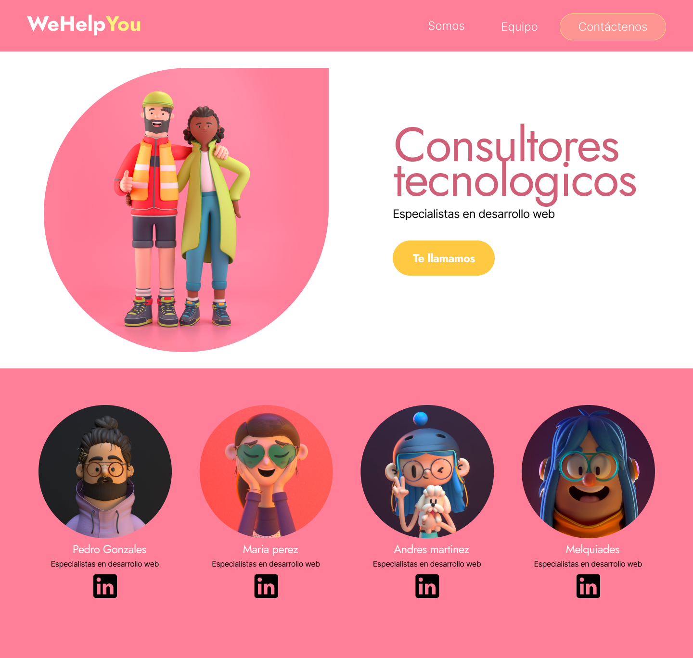
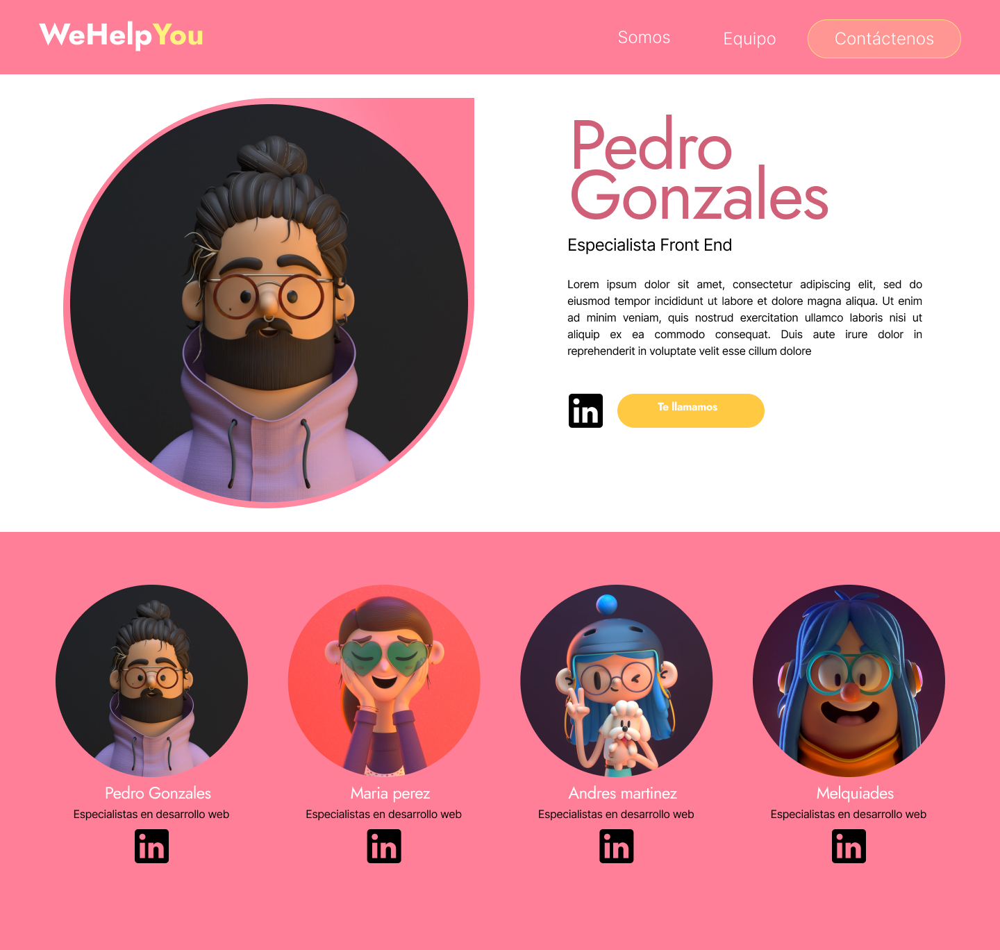
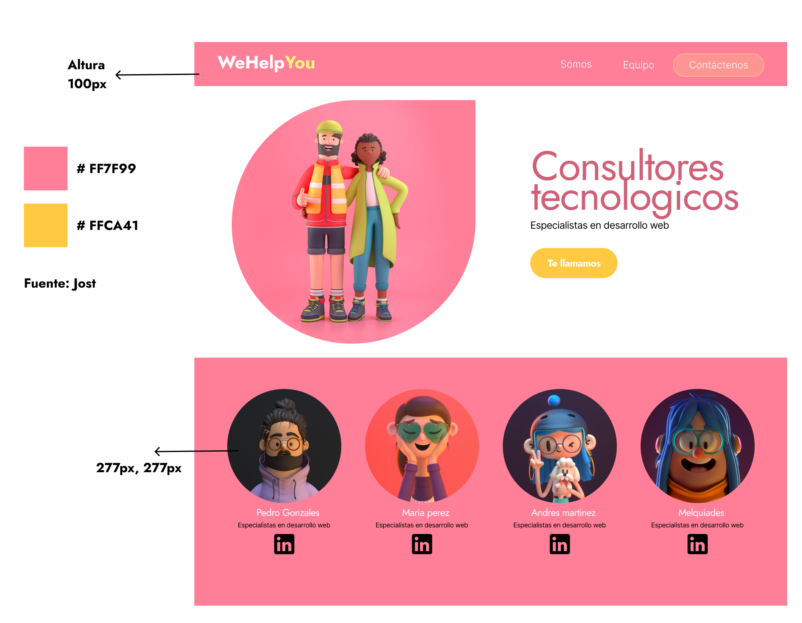

## Objetivos

> Durante la primera semana nos introduciremos en el mundo del desarrollo web, mezclaremos varios temas, herramientas y metodologías para hacer una pequeña aproximación al mundo de IT.
> 

- Abrir una cuenta en Figma
- Trabajar sobre componentes, aplicando atomic design
- Crear la página web usando HTML5 y CSS3

## 🔧 Competencias técnicas

- Maquetar una aplicación desktop
- Crear una página web estática

## 💻 Herramientas

- Figma
- Visual Studio Code
- Trello

## 🗺 Contexto del proyecto

> Tras graduaros exitosamente en el bootcamp de programación y trabajar como desarrolladoras de software en diferentes empresas, habéis decidido asociaros para crear vuestra propia empresa de desarrollo. 
Una vez decidido el nombre de vuestra empresa, el siguiente paso es crear una página para que vuestros potenciales clientes os contraten. Esta página reflejará quiénes sois y vuestra amplia experiencia en desarrollo de todo tipo de proyectos.

### 🕐 Por dónde empezar

Vuestra primera tarea es **decidir el nombre de la empresa** en el que trabajaréis. Tras reuniros entre vosotras para planificar el trabajo, habéis recopilado los diferentes componentes que queréis que tenga la página y las habéis repartido entre el equipo*,* de modo que sea más fácil abordar todo lo que hay que hacer.

**Ideación (Inception) del proyecto, organización del equipo y Kickoff**
Durante el primer día, el equipo debe decidir cuál será la forma de trabajar en el día a día, cuáles son los principales items que se van a incluir *(Product Backlog)*, escoger una scrum master que liderará al equipo de desarrolladoras y una product owner que será la encargada de hacer preguntas y negociaciones con el cliente.

**Sprints semanales (2 semanas en total)**

- Al comienzo del sprint, el equipo debe acordar cuáles son las historias de usuario que van a hacer durante el sprint (*Sprint Backlog*).
- Al final del Sprint, el equipo debe hacer una *demo* al cliente de las historias de usuario que haya conseguido terminar.
- Al final, el equipo puede hacer una *retrospectiva* para mejorar la forma de trabajar de cara al siguiente sprint o proyecto.
- Durante el Sprint es recomendable hacer una reunión muy breve al comienzo de la jornada (*Daily meeting*) para que cada persona del equipo explique lo que está haciendo y los problemas o dificultades que se está encontrando.

## 🗃 Entregables
- **Presentación**
    - Equipo:
        - ¿Quiénes somos?
        - ¿Qué he aportado?
        - ¿Qué he aprendido?
        - ¿Qué obstáculos he tenido?
        - ¿Cómo lo he resuelto?
        - ¿Qué tecnologías y herramientas hemos usado?
        - ¿Cómo hemos planificado? (Kanban))
    - Maqueta y prototipo en figma
    - Demo de la página
    - Código
- **Requisitos**
    - Mockup
    - Utilizar Metodologías Ágiles
    - Kanban - historias de usuario y tareas
- **¿Qué evaluamos?**
    - Calidad de la presentación
    - Participación de todas las integrantes del equipo
    - Calidad del código
    - Demostración de la página
- **Criterios de Rendimiento**
    - La maqueta (mockup) en figma debe ser exactamente igual a la muestra entregada.
    - El desarrollo debe ser exactamente igual a la maqueta.
    - Todas deben de haber participado en la realización del proyecto.
 
## Ejercicios Relacionados

- [Frogg - Flexbox CSS](https://flexboxfroggy.com/)
- [Garden - Grid CSS](https://cssgridgarden.com/#es)
- [w3Schools - HTML Exercices](https://www.w3schools.com/html/html_exercises.asp)
- [w3Schools - CSS Exercices](https://www.w3schools.com/css/css_exercises.asp)

## Recursos básicos

- [Guia de HTML](https://developer.mozilla.org/es/docs/Learn/HTML)
- [Guia de CSS](https://developer.mozilla.org/es/docs/Learn/CSS)
- [Scrum](https://www.scrum.org/resources/what-is-scrum)
- [W3Schools](https://www.w3schools.com)
- [CSS Tricks](https://css-tricks.com/)
